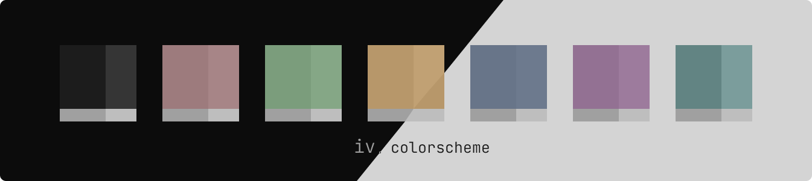

  
  <h1>iv.</h1>
  
A dark vibrant minimal colorscheme designed for dark modes.

  <a href="#resources"><strong>Explore the design resources »</strong></a>  
      
  
  <a href="#themes">Themes</a> ·
  <a href="#palette">Palette</a> ·
  <a href="#acknowledgment">Acknowledgment</a>
  
  

<!-- TABLE OF CONTENTS -->

  
Table of Contents

   
  <ol>
    <li>
      <a href="#about">About the colorscheme</a>
      <ul>
        <li><a href="#built-with">Built With</a></li>
      </ul>
    </li>
    <li>
      <a href="#themes">Themes</a>
      <ul>
        <li><a href="#available-themes">Available Themes</a></li>
      </ul>
    </li>
    <li>
      <a href="#branding">Palette</a>
      <ul>
        <li><a href="#spades">Spades</a></li>
        <li><a href="#cloverT">Clover</a></li>
      </ul>
    </li>
    <li>
      <a href="#branding">Branding</a>
      <ul>
        <li><a href="#resources">Resources</a></li>
      </ul>
    </li>
    <li><a href="#acknowledgment">Acknowledgment</a></li>
  </ol>

 

## About

## Themes

## Palette

## Branding

## Acknowledgment

