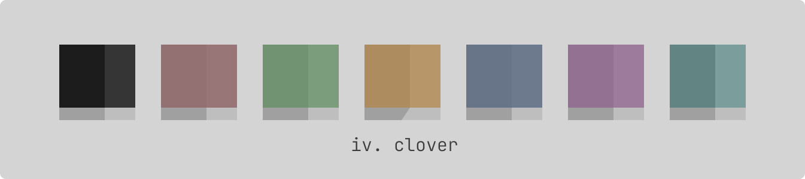

## Clover
A light theme for the IV. that consist of the main color. Intended to be attractive and elegant in the eyes of the user. It aims to be high-contrast.
Yet preserving a reasonable degree of low-contrast that emphasizes simplicity and readability of the theme. Clover is made with adjusting the Spade theme
10% more darker to fit the needs of the theme.
