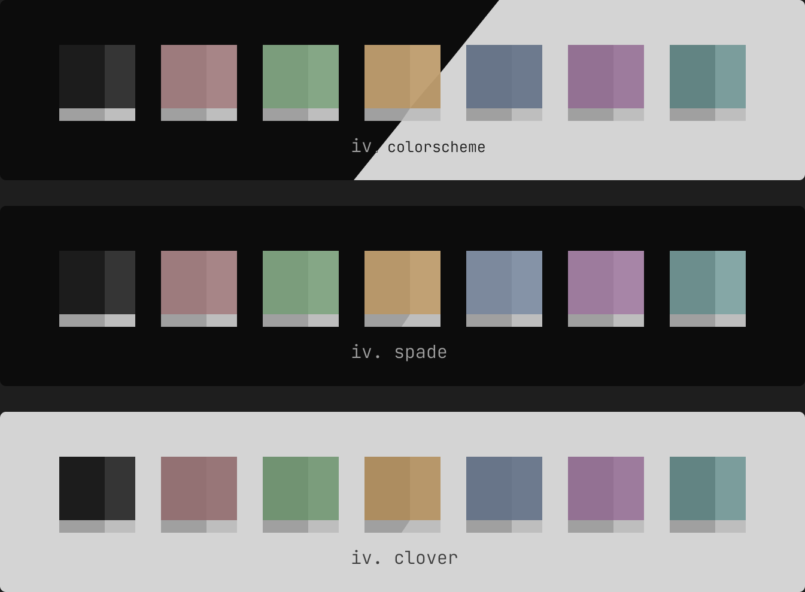
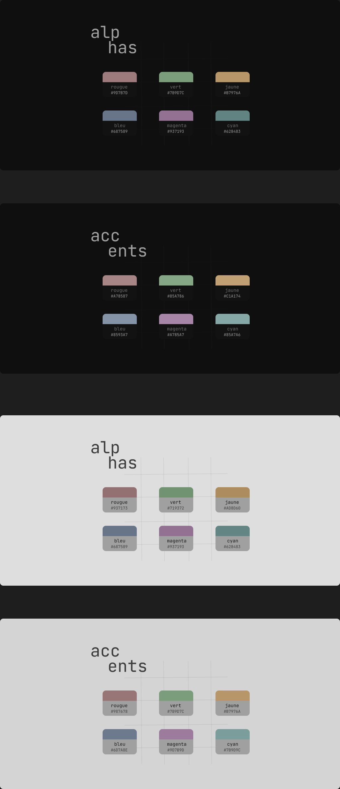

## Resources
All resource file to help visualize IV. (All files are made with figma)  

### [Colorscheme](./colorscheme.fig)  
Resource file for all colorschemes.

<!-- 

  
Preview

    -->
  
<!-- 
 -->

### [Palettes](./palettes.fig)  
Resource file for all palettes (alphas and accents)  

